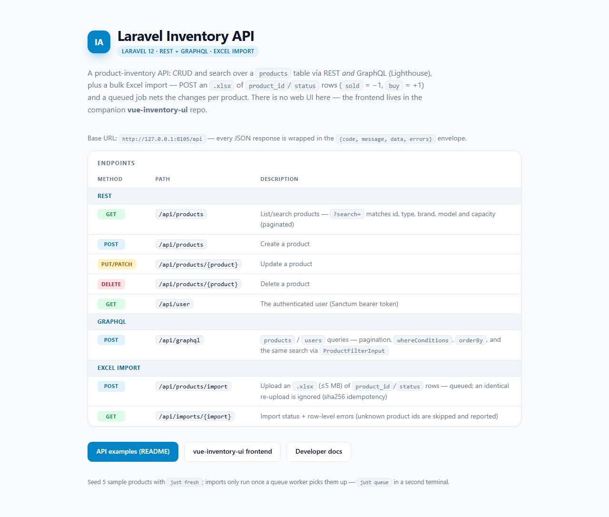

# Laravel Inventory API

A Laravel 12 product-inventory API: CRUD and search over a `products` table via REST
**and** GraphQL (Lighthouse), plus a bulk Excel import — POST an `.xlsx` of
`product_id`/`status` rows (`sold` = −1, `buy` = +1) and a queued job nets the changes
per product and upserts the new stock quantities. Every import run is recorded: row-level
errors are reported at `GET /api/imports/{id}`, and re-uploading an identical file is
ignored (sha256 idempotency key). Backend for the companion `vue-inventory-ui`
frontend; the only page it serves itself is an API landing page mapping every endpoint.

**Frontend:** the Vue UI half of this system lives at
[dxiiren/vue-inventory-ui](https://github.com/dxiiren/vue-inventory-ui).



> **New developer? Start with [`.docs/tldr.md`](.docs/tldr.md)** — every doc summarised on one
> page. The full guide lives in [`.docs/`](.docs/README.md).

## Prerequisites

| Tool | Version | Installed by |
| --- | --- | --- |
| PowerShell + winget | Windows 10/11 stock | — (the only true prerequisites) |
| Git | any recent | `setup.ps1` |
| PHP | 8.4 (pinned to `%LOCALAPPDATA%\Programs\php-8.4`) | `setup.ps1` |
| Composer | 2.x (`composer.phar` next to PHP) | `setup.ps1` |
| Node.js | LTS (npm for the Vite asset build) | `setup.ps1` |
| uv + Python | latest (Claude tooling/statusline) | `setup.ps1` |
| just | any recent | `setup.ps1` |
| Claude Code CLI | latest | `setup.ps1` (optional, for AI-assisted dev) |

## Quick start

```powershell
# 1. One-time machine setup (idempotent — safe to re-run)
pwsh ./setup.ps1

# 2. Close and reopen PowerShell so PATH updates land
# 3. One-time app bootstrap: composer + npm + .env (sqlite) + migrate + asset build
just bootstrap

# 4. Start the dev server
just start

# 5. Optional: seed 5 sample products
just fresh
```

The app is now at **http://127.0.0.1:8105**. Stop it with `just stop`.

Try it: `curl.exe http://127.0.0.1:8105/api/products` — a paginated JSON product list
wrapped in the `{code, message, data, errors}` envelope. GraphQL lives at
`POST http://127.0.0.1:8105/api/graphql`. Both reads are public.

**Writes need a Sanctum token.** `POST/PUT/PATCH/DELETE /api/products*`,
`POST /api/products/import` and `GET /api/imports/{id}` sit behind `auth:sanctum` and
answer `401` without one. There is no login route yet — mint a token by hand:

```powershell
php artisan tinker
# >>> App\Models\User::factory()->create()->createToken('local')->plainTextToken
```

Then send it as `Authorization: Bearer <token>` on every write.

**Excel import needs a queue worker.** `POST /api/products/import` only queues the job —
run `just queue` in a second terminal to actually process it. A sample upload file is at
`database/seeders/product_status_list.xlsx`.

## API examples

### REST — search products

```powershell
curl.exe "http://127.0.0.1:8105/api/products?search=4450"
```

```json
{
  "code": 200,
  "message": "Success",
  "data": {
    "current_page": 1,
    "data": [
      {
        "id": 4450,
        "type": "Smartphone",
        "brand": "Apple",
        "model": "iPhone SE",
        "capacity": "2GB/16GB",
        "quantity": 13,
        "created_at": "2026-08-02T02:07:56.000000Z",
        "updated_at": "2026-08-02T02:07:56.000000Z"
      }
    ],
    "per_page": 10,
    "total": 1
  },
  "errors": null
}
```

(Pagination URLs elided — the `data` key holds the full Laravel paginator, so the rows sit
at `data.data`.) `search` matches id, type, brand, model and capacity.

### GraphQL — same search at `POST /api/graphql`

```powershell
curl.exe -X POST http://127.0.0.1:8105/api/graphql -H "Content-Type: application/json" -d '{\"query\":\"query SearchProducts($filter: ProductFilterInput) { products(filter: $filter) { paginatorInfo { total } data { id type brand model capacity quantity } } }\",\"variables\":{\"filter\":{\"search\":\"iPhone SE (2020)\"}}}'
```

```json
{
  "data": {
    "products": {
      "paginatorInfo": { "total": 1 },
      "data": [
        {
          "id": 6039,
          "type": "Smartphone",
          "brand": "Apple",
          "model": "iPhone SE (2020)",
          "capacity": "3GB/64GB",
          "quantity": 18
        }
      ]
    }
  }
}
```

The GraphQL endpoint is `/api/graphql` (not `/graphql`), and `products(filter: {search})`
reuses the same model scope as the REST `?search=` — both return the same result set.

### Excel import + the import report

```powershell
curl.exe -H "Authorization: Bearer $TOKEN" `
  -F "file=@database/seeders/product_status_list.xlsx" http://127.0.0.1:8105/api/products/import
# -> {"code":200,"message":"Uploading is in process and submitted successfully",
#     "data":{"import_id":1, ...},"errors":null}
```

Each upload creates an **import record** (keyed by the file's sha256). Once the queue
worker has processed the job, `GET /api/imports/{id}` returns the run's status and every
malformed row — unknown product ids, missing columns, invalid statuses — with its actual
spreadsheet row number:

```powershell
curl.exe "http://127.0.0.1:8105/api/imports/1"
```

```json
{
  "code": 200,
  "message": "Success",
  "data": {
    "id": 1,
    "file_name": "product_status_list.xlsx",
    "file_hash": "54fbe933c5c6174f7f0ebc53ff21f839469f46e279123083cf3c4980f6493798",
    "status": "completed",
    "row_errors": [
      { "row": 19, "product_id": 6040, "error": "Unknown product_id 6040 — row skipped" },
      { "row": 20, "product_id": 6041, "error": "Unknown product_id 6041 — row skipped" }
    ],
    "created_at": "2026-08-02T02:08:35.000000Z",
    "updated_at": "2026-08-02T02:08:37.000000Z"
  },
  "errors": null
}
```

`status` walks `pending` → `processing` → `completed` (or `failed`). Re-uploading a
byte-identical file is acknowledged with the **original** `import_id` and a
"duplicate upload ignored" message — the quantity nets are never applied twice. Only a
`failed` run may be retried.

## Commands

Run `just` with no arguments to list every recipe. The ones you'll use daily:

| Command | What it does |
| --- | --- |
| `just bootstrap` | One-time app setup: deps, `.env` (sqlite), db, migrate, asset build |
| `just start` | Serve on http://127.0.0.1:8105 in the background |
| `just stop` | Stop only THIS repo's `php.exe` processes |
| `just serve` | Serve in the foreground (Ctrl+C to stop) |
| `just queue` | Run the queue worker (foreground) — processes Excel import jobs |
| `just migrate` | Run pending migrations |
| `just fresh` | Drop, re-migrate and seed (5 sample products) — destroys local data |
| `just test` | PHPUnit suite, 64 tests on sqlite `:memory:` (`just test --filter=ProductTest` to narrow) |
| `just lint` / `just lint-fix` | Laravel Pint style check / auto-fix |
| `just claudex` | Launch Claude Code (Sonnet, all permissions) |

## Troubleshooting

### POST /api/products/import returns 200 but products never change

That's the queue: the upload is stored and `ImportProductsFromExcelJob` is queued on the
`database` connection. Run `just queue` to process it. Also note the import only adjusts
quantities of **existing** product ids — unknown ids in the sheet are skipped and recorded
as row-level errors on the import report (`GET /api/imports/{id}`).

### Re-uploading the same Excel file succeeds but changes nothing

That's the idempotency guard: the file's sha256 matches an earlier import, so the upload is
acknowledged with the original `import_id` and no job is dispatched. Change the file's
content to import again; only a `failed` run may be retried with the same file.

### `could not find driver` or MySQL connection errors on artisan commands

Your `.env` still points at MySQL (the committed `.env.example` default). `just bootstrap`
writes a fresh `.env` with `DB_CONNECTION=sqlite` — either delete `.env` and re-run
`just bootstrap`, or set `DB_CONNECTION=sqlite` and comment out the `DB_*` lines yourself.
Don't edit `.env.example`.

### Port 8105 already in use

Another serve is lingering. `just stop` kills only this repo's `php.exe` processes; re-run
`just start`. To serve on a different port (e.g. 8000 for the Vue frontend's default):
`$env:PORT=8000; just start`.

## Project layout

```
laravel-inventory-api/
  app/
    Contracts/              # ProductRepositoryInterface
    Data/                   # ProductData (spatie/laravel-data DTO)
    Enums/                  # ProductStatusEnum (sold | buy)
    Http/Controllers/       # ProductController (index/store/update/destroy/import),
                            # ImportController (import report)
    Http/Middleware/        # ApiDataResponse ({code, message, data, errors} envelope)
    Http/Requests/          # ImportProductRequest (xlsx, <=5MB)
    Imports/                # ProductImport (chunked, nets sold/buy, upserts quantity,
                            # records row-level errors)
    Jobs/                   # ImportProductsFromExcelJob (queued; updates the import record)
    Models/                 # Product, Import, User
    Repositories/           # ProductRepository (incl. sha256 idempotency guard)
  database/                 # migrations, ProductFactory, ProductSeeder + sample xlsx
  graphql/                  # schema.graphql + product.graphql + user.graphql
  routes/                   # api.php (products CRUD + import + import report), web.php (API landing page)
  tests/                    # ApiAuthorization, ApiDataResponseEnvelope, Product, ProductGraphql, ProductImport, ProductImportFailure, ImportStatusTransition, ImportFileCleanup, Smoke
  xlsx_import_backend.sql   # MySQL dump matching .env.example defaults (optional)
  justfile, setup.ps1       # dev recipes + one-time machine setup
  .docs/                    # numbered documentation set
  .claude/                  # skills, hooks, settings
```
